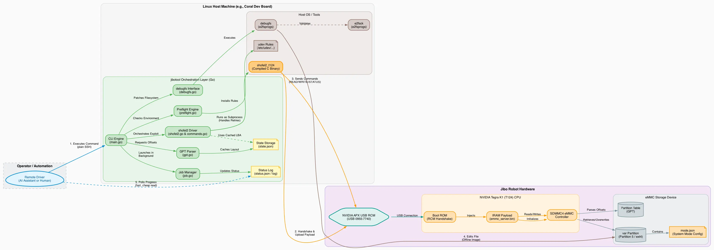
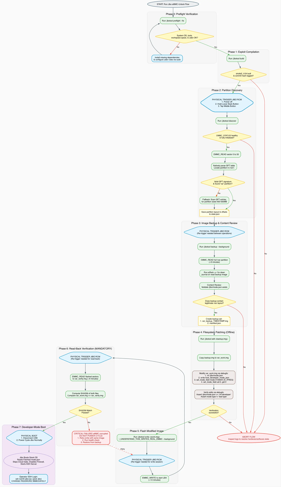

# jibotool

A Go CLI that drives the Jibo RCM eMMC-unlock exploit from **non-interactive,
JSON-emitting subcommands**, so it can be operated over a plain SSH
connection by an automated driver (including an AI assistant) rather than
requiring a human at an interactive terminal for every step.

It does not reimplement the RCM/USB exploit itself, `shofel2_t124` still does
that. `jibotool` is an orchestration layer: GPT partition parsing, `debugfs`
edits, mandatory write verification, background job management, and
structured status.

## Background: why Jibo needs this at all

Jibo runs a stock Buildroot Linux on an NVIDIA Tegra K1 (T124). After the
Jibo Inc. cloud shut down in 2019, every unit boots to a "jibo." splash and
hangs there indefinitely, a cloud handshake fails and there is no timeout or
offline fallback.

The fix doesn't replace the OS. It modifies one config file
(`/var/jibo/mode.json`) so the stock OS boots into a developer mode that
skips the cloud gate, disables the firewall, and starts an SSH server:

```
/var/jibo/mode.json: {"mode":"normal"} → {"mode":"int-developer"}
```

`int-developer` mode on the stock firmware:

- Skips the cloud-handshake gate
- Disables the iptables firewall
- Starts an SSH server (`root` / `jibo`, change immediately)

### How the exploit works

The Tegra K1 boot ROM has a buffer-overflow vulnerability in its USB
Recovery Mode (RCM), the same family of exploits that enabled Nintendo
Switch homebrew (Fusée Gelée). Holding the lower back button and tapping the
middle button puts Jibo into RCM, where it enumerates over USB as
`0955:7740 NVIDIA Corp. APX`. From there you can load an arbitrary ARM
payload into IRAM.

The [`devsparx/ShofEL2-for-T124-Jibo-Edition`](https://github.com/devsparx/ShofEL2-for-T124-Jibo-Edition)
fork (branch `improvements/IncreasedUSBReadWriteSpeed`) adds an
`emmc_server` payload that brings up Jibo's SDMMC4 eMMC controller from
IRAM, giving raw sector read/write access without needing DRAM init. The
host binary is `shofel2_t124`, built on
[`wertus33333/ShofEL2-for-T124`](https://github.com/wertus33333/ShofEL2-for-T124),
which compiles and runs the foundational Tegra K1 *ShofEL2* / *Fusée Gelée*
exploit designed and researched by fail0verflow and Katherine Temkin. This
project also references the
[Jibo Revival Group's JiboAutoMod](https://github.com/Jibo-Revival-Group/JiboAutoMod)
for USB state settling, RCM handshake retrying, and non-interactive
orchestration principles.

## Why a Go CLI instead of an interactive script

The original plan was an interactive bash script (`jibo-unlock.sh`), run by
hand over a board's shell session. Testing surfaced a better path:

- **Non-interactive SSH drivers (e.g. `mdt exec`/`mdt shell`) are
  unreliable** when invoked non-interactively, both failed with
  `ioctl`/socket errors when called from an automated context. Plain SSH
  works perfectly, using whatever key is already provisioned for the host.
- The real gap was that the interactive script was built for a human
  sitting at a prompt: `confirm()`/`pause()` calls, single blocking
  9 to 14 minute operations, and unstructured text output a driver would
  otherwise have to scrape.

`jibotool` closes that gap: every command emits one JSON object, long
operations can run detached with progress polled from a status file, and
the confirmation gates that matter for hardware safety are enforced by the
CLI itself (an exact confirm phrase required as an argument to `write`),
not by a TTY prompt.

## Architecture



*(Source: [`docs/architecture.dot`](docs/architecture.dot))*

- **`shofel2_t124`** (C, unmodified): all actual RCM/USB/eMMC hardware
  access. Requires a physical USB connection to Jibo, so it must run on
  whatever host is physically wired to the robot.
- **`jibotool`** (this repo, Go, cross-compilable to `linux/arm64` or
  `linux/armv7`): wraps `shofel2_t124` as a subprocess, parses its output
  (including detecting the "waiting for RCM" state so a driver knows
  exactly when to prompt for the physical button combo), does GPT parsing
  natively, shells out to `debugfs` for ext4 edits, and manages background
  jobs plus JSON status files.
- **The physical RCM trigger** (hold lower button, tap middle button) can
  never be automated. Every operation that needs Jibo in RCM mode reports
  `"waiting_for_rcm": true` in its status until a human does this, informed
  by `shofel2_t124`'s actual state, not a guess made in advance.

## Safety review: what a careful read of the exploit source turned up

Before running anything against real hardware, this project's safety
review read `shofel2_t124`'s actual C source rather than trusting the
how-to guides that exist for this exploit. Findings that shaped the tool:

| Finding | How `jibotool` handles it |
|---|---|
| Sector arguments are parsed as **hex, not decimal** (`sscanf("%x", ...)`) | `hexArg()` is the *only* function that formats a sector number, used everywhere, unit-tested |
| `EMMC_WRITE` has no built-in write verification beyond a single status word | Mandatory SHA256 compare after every write; `write`/`restore` return `"verified": false` and refuse to say it's safe to power-cycle if it fails |
| `mode.json`'s inode must be `0100644`, not bare `0644`, or the boot silently breaks | Explicit inode-type check in `DebugfsWriteFile` |
| The exploit branch has a documented eMMC write-corruption incident in its own history | Records the exact git commit built, in `state.json` |
| The write step is genuinely irreversible-risk | `write`/`restore` require an exact confirm phrase (`I_UNDERSTAND_THIS_WRITES_REAL_EMMC`) as a CLI argument, a deliberate gate at the tool level, not just a conversational one |

Two more bugs surfaced only once this was run against real hardware,
neither was visible from code review alone:

1. **Non-interactive SSH's `PATH` doesn't include `/sbin`.** `debugfs` and
   `e2fsck` live in `/sbin` on a typical board, but a non-interactive SSH
   command's default `PATH` doesn't include it, even though an interactive
   login shell's might. `jibotool` widens its own `PATH` at startup
   (`widenPATH()` in `main.go`) rather than special-casing every call site.
2. **`shofel2_t124` opens its ARM payload files by relative path.** Running
   it with an unrelated working directory produces a misleading partial
   failure while still appearing to proceed through the RCM handshake.
   Fixed by setting `cmd.Dir` to the repo directory in every invocation.

## Build

```bash
make build          # host arch, ./bin/jibotool
make arm64          # cross-compile linux/arm64, ./bin/jibotool-linux-arm64
make armv7          # cross-compile linux/armv7, ./bin/jibotool-linux-armv7
make test
```

## Usage

```
jibotool — non-interactive driver for the Jibo RCM eMMC unlock

Usage: jibotool <command> [args] [flags]

Commands:
  preflight [--fix]                Verify required host libraries (libusb, e2fsprogs) and udev rules;
                                   use --fix to automatically install dependencies (via apt-get).
  build [--update]                 Clone and compile the underlying shofel2_t124 exploit tool and ARM payloads;
                                   use --update to pull the latest commit from the devsparx repository.
  status                           Perform EMMC_STATUS check to verify eMMC controller has initialized cleanly.
  discover                         Read GPT partition table natively and locate Jibo's /var partition (Partition 5);
                                   saves partition sectors and offsets to state.json.
  backup                           Perform full read of Jibo's /var partition to a timestamped backup image (~9 min).
                                   Requires Jibo in RCM mode. Clean journal and verify structure automatically.
  edit <backup.img>                Create a copy of backup.img to var_work.img and patch mode.json to int-developer.
                                   Checks ext4 inode integrity and asserts correct file type.
  patch-file <img_path> <path_in_img> <local_content_file> [--show-diff]
                                   Patch any other file inside an image in-place (e.g. WiFi config).
                                   Content is redacted from output logs by default unless --show-diff is passed.
  write <work_img> I_UNDERSTAND_THIS_WRITES_REAL_EMMC
                                   Flash work_img back to real eMMC (~14 min) and perform a mandatory
                                   RCM read-back and SHA256 integrity verification (~9 min).
  restore <backup_img> I_UNDERSTAND_THIS_WRITES_REAL_EMMC
                                   Flash backup_img back to real eMMC (~14 min) to restore a prior clean state,
                                   followed by mandatory read-back and SHA256 integrity verification.
  health                           Read eMMC's EXT_CSD register and report Device Life Time and Pre-EOL status.
  jobs [id]                        List all background job IDs, or display a specific job's status.json.

Flags (can be passed to any command):
  --workdir <path>                 Override default work directory (default: /opt/jibo-unlock)
  --background                     Run command as a detached background process; prints a job ID to poll.
  --job-dir <path>                 (Internal) Used by background child processes to track task execution.

Hardware Note:
  All long-running commands (status/discover/backup/write/restore/health) require Jibo to be physically
  put into RCM mode (Hold LOWER small back button, tap MIDDLE button). They will report "waiting_for_rcm": true
  in their status/JSON envelope until you trigger RCM.
```

### The unlock flow, visualized



*(Source: [`docs/interaction.dot`](docs/interaction.dot))*

### RCM button combo

```
1. Power Jibo OFF.
2. Connect the rear micro-USB port to your Linux host.
3. Hold the LOWER small button on the back.
4. While holding it, tap the larger MIDDLE button once.
5. Release. Front LED turns RED.
6. Device enumerates as 0955:7740 NVIDIA Corp. APX.
```

### The unlock flow, end to end

```bash
jibotool preflight --fix
jibotool build
jibotool status                                  # EMMC_STATUS health check
jibotool discover                                # locate /var partition
jibotool backup --background                     # returns a job dir immediately
jibotool jobs <job-id>                            # poll progress
jibotool edit <backup.img>
jibotool write <work.img> I_UNDERSTAND_THIS_WRITES_REAL_EMMC --background
jibotool jobs <job-id>                            # poll until done+verified
```

### Requirements

| Requirement | Notes |
|---|---|
| Linux host | macOS and Windows cannot drive the Tegra RCM USB loader (Linux `usbdevfs` ioctls only). A Coral Dev Board running Mendel Linux, or any Linux box with a spare USB port, works. |
| `gcc-arm-none-eabi` | Builds the ARM payloads |
| `libusb-1.0-0-dev` | Host loader USB I/O |
| `e2fsprogs` | `e2fsck` and `debugfs` for image manipulation |
| `git`, `make`, `go` | Build and orchestration |

`jibotool preflight --fix` installs missing packages via `apt-get` where
possible.

## What you get after unlock

- Root SSH: `ssh root@<jibo-ip>` password `jibo`, **change immediately**.
- The rootfs is mounted read-only by default; remount to make changes:
  ```bash
  mount -o remount,rw /
  # ...edits...
  mount -o remount,ro /
  ```
- The stock firmware is otherwise intact. All partitions except `/var` are
  untouched. The eye animation falls back to a green checkmark (the proper
  eye needs cloud auth), and voice/skills services are non-functional
  without a cloud substitute.
- Body service WebSocket API is live at `ws://<jibo-ip>:8282`, LED, motors,
  display, touch, and IMU are all accessible from here.

## Known gotchas

- **WiFi DHCP race on first developer-mode boot.** `udhcpc` runs before
  `wpa_supplicant` brings up the interface. SSH via IPv6 link-local (avahi
  advertises it) and run `udhcpc -i wlan0 -n` to get an IPv4 address.
- **`/tmp` is `noexec`.** Invoke scripts as `sh /tmp/script.sh`, not
  `/tmp/script.sh`.
- **Do not run `jibo-platform-test`.** It's the manufacturing test suite
  and will stress every motor. On a unit that's sat for years this can
  fault axes and kick the unit off WiFi.
- **Body-service idle timer.** After about 5 minutes of display
  inactivity the panel goes dark. Wake it: `POST {"screen":"on"}` to
  `http://<jibo-ip>:8282/screen`.

## Data safety

Only Jibo's `/var` partition is read or written, and only after
`discover`'s partition-identification result is checked against a
`debugfs`-listed `/jibo` directory. All other partitions (rootfs, skills)
are never touched. `backup` produces a complete image of `/var` before any
modification; `restore` returns a unit to that exact pre-unlock state and
is itself followed by a read-back verification.

## Credits

- [mkemka/jibo-unlock-notes](https://github.com/mkemka/jibo-unlock-notes), the original end-to-end unlock recipe
- [devsparx/ShofEL2-for-T124-Jibo-Edition](https://github.com/devsparx/ShofEL2-for-T124-Jibo-Edition), the exploit fork with eMMC read/write
- [wertus33333/ShofEL2-for-T124](https://github.com/wertus33333/ShofEL2-for-T124), upstream ShofEL2 compilation for T124
- [fail0verflow — ShofEL2 Vulnerability Write-Up](https://fail0verflow.com/blog/2018/shofel2/), original vulnerability and Fusée Gelée exploit analysis
- [Katherine Temkin — Fusée Gelée Exploit Report](https://github.com/Qyriad/fusee-launcher/blob/master/report/fusee_gelee.md), detailed buffer-overflow exploit blueprint
- [Jibo Revival Group / JiboAutoMod](https://github.com/Jibo-Revival-Group/JiboAutoMod), non-interactive orchestration and USB-settling prior art

## License

Apache License 2.0, see [LICENSE](LICENSE).
