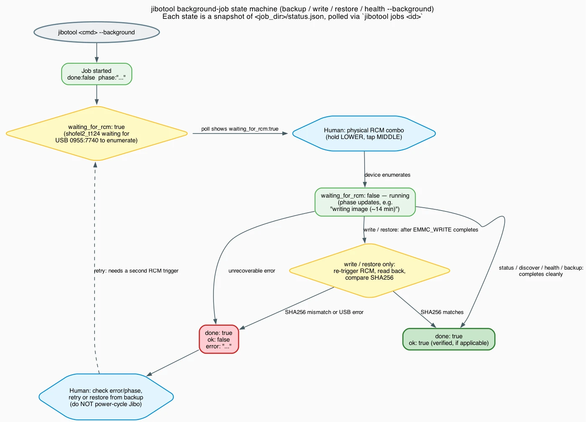

# jibotool user guide

The `README.md` at the repo root is the front door — scope, safety summary,
and a condensed quickstart. This document is self-contained: everything
from compiling `jibotool` itself through a full unlock, the safety-review
findings that shaped the tool, the background-job model, troubleshooting,
and the history of why this tool exists in the first place. You can start
here directly without having read the README first.

## Contents

- [Build jibotool](#build-jibotool)
- [Prerequisites](#prerequisites)
- [The RCM button combo](#the-rcm-button-combo)
- [Step-by-step: the full unlock flow](#step-by-step-the-full-unlock-flow)
- [The background-job model](#the-background-job-model)
- [Patching other files (e.g. WiFi config)](#patching-other-files-eg-wifi-config)
- [If write verification fails](#if-write-verification-fails)
- [What you get after unlock](#what-you-get-after-unlock)
- [Next steps: restoring full functionality](#next-steps-restoring-full-functionality)
- [Known gotchas](#known-gotchas)
- [Safety review: what a careful read of the exploit source turned up](#safety-review-what-a-careful-read-of-the-exploit-source-turned-up)
- [Why this exists: background and design rationale](#why-this-exists-background-and-design-rationale)
- [Troubleshooting](#troubleshooting)

---

## Build jibotool

`jibotool` is a single self-contained Go binary — no runtime dependencies
beyond the host tools it shells out to (`debugfs`, `e2fsck`, and the
`shofel2_t124` binary it builds separately, [via `jibotool
build`](#2-build-the-exploit-jibotool-build), once it's running on your
host). Build it wherever you have Go installed,
then get the binary onto the Linux host that's physically wired to Jibo
over USB (these are often two different machines — e.g. build on your
laptop, run on a Coral Dev Board).

```bash
git clone https://github.com/ghchinoy/jibotool.git
cd jibotool
go test ./...    # optional, confirms your toolchain/checkout is sane
```

| Target | Command | Output |
|---|---|---|
| Host architecture (for local testing / dry runs) | `make build` | `./bin/jibotool` |
| Coral Dev Board (linux/arm64) | `make arm64` | `./bin/jibotool-linux-arm64` |
| Running directly on Jibo's own Tegra K1 (linux/armv7) | `make armv7` | `./bin/jibotool-linux-armv7` |

If your build host *is* the machine wired to Jibo, `make build` is all you
need — just run `./bin/jibotool` in place. Otherwise, get the
cross-compiled binary onto that host:

```bash
# Automatic: builds arm64 and scp's it over in one step
make deploy HOST=<board-ip> HOST_USER=<user> SSH_KEY=~/.ssh/id_ed25519

# Manual, if you'd rather control each step
make arm64
scp ./bin/jibotool-linux-arm64 <user>@<board-ip>:~/jibotool
ssh <user>@<board-ip> "chmod +x ~/jibotool && ~/jibotool version"
```

`make deploy` defaults to `HOST=192.168.1.50`, `HOST_USER=mendel`, and
`SSH_KEY=~/.ssh/id_ed25519` — override any of them for your setup. The
final `~/jibotool version` in the manual path is just a sanity check that
the binary landed and runs; expect `jibotool 0.1.0` (or later) back.

From here on, every command in this guide is run **on the host with the
physical USB connection to Jibo** — either locally (`./bin/jibotool ...`)
or over SSH to wherever you deployed it (`ssh ... "~/jibotool ..."`).

## Prerequisites

| Requirement | Notes |
|---|---|
| Linux host | macOS and Windows cannot drive the Tegra RCM USB loader (Linux `usbdevfs` ioctls only). A Coral Dev Board running Mendel Linux, or any Linux box with a spare USB port, works. |
| `gcc-arm-none-eabi` | Builds the ARM payloads |
| `libusb-1.0-0-dev` | Host loader USB I/O |
| `e2fsprogs` | `e2fsck` and `debugfs` for image manipulation |
| `git`, `make`, `go` | Build and orchestration |
| Micro-USB cable | Connects to Jibo's rear RCM port |
| ~1.5 GB free disk | A backup + work + verify image trio at ~500 MB each, at the work directory (default `/opt/jibo-unlock`) |

`jibotool preflight --fix` installs missing packages via `apt-get`, writes
the udev rule for VID `0955`, and creates the work directory — run it
first and let it tell you what's missing before doing anything by hand.

## The RCM button combo

You'll need to do this several times over the course of a full unlock —
once per command that needs to talk to Jibo's boot ROM.

```
1. Power Jibo OFF.
2. Connect the rear micro-USB port to your Linux host.
3. Hold the LOWER small button on the back.
4. While holding it, tap the larger MIDDLE button once.
5. Release. Front LED turns RED.
6. Device enumerates as 0955:7740 NVIDIA Corp. APX.
```

`lsusb` should show `0955:7740` once this worked. Every `jibotool` command
that needs Jibo in RCM mode reports `"waiting_for_rcm": true` in its status
until you do this — informed by `shofel2_t124`'s actual state, not a guess
made in advance, so there's no fixed "do this N seconds after starting the
command" timing to get right.

## Step-by-step: the full unlock flow

All commands below assume `jibotool` is on the same Linux host that's
physically wired to Jibo over USB, and that `~/jibotool` is the binary
(adjust the path if you built/installed it elsewhere). Default work
directory is `/opt/jibo-unlock` — override with `--workdir <path>` on any
command if that doesn't fit your host's partitioning.

### 1. Preflight

```bash
~/jibotool preflight --fix
```

Verifies libusb, e2fsprogs, the udev rule, and disk space; `--fix`
installs/configures what's missing.

### 2. Build the exploit (`jibotool build`)

Not to be confused with [building `jibotool` itself](#build-jibotool)
above — this is a separate, on-host step that compiles the exploit binary
`jibotool` drives.

```bash
~/jibotool build
```

Clones `devsparx/ShofEL2-for-T124-Jibo-Edition`
(`improvements/IncreasedUSBReadWriteSpeed` branch) and compiles
`shofel2_t124` plus its ARM payloads. Skips silently if already built —
pass `--update` to pull and rebuild explicitly (deliberately not
automatic, given this branch's [documented corruption
history](#safety-review-what-a-careful-read-of-the-exploit-source-turned-up);
don't pick up a different, unreviewed HEAD without noticing). Records the
exact commit hash built in `state.json`.

### 3. Health check

Trigger RCM, then:

```bash
~/jibotool health
```

Reads the EXT_CSD register and reports `life_time_estimation_a`/`_b` and
Pre-EOL status. Worth running before touching any unit that's sat in
storage for years — a `warning` or `critical` reading means the eMMC has
excessive wear and you should think twice before a write-heavy operation.

### 4. Discover the `/var` partition

Trigger RCM again, then:

```bash
~/jibotool discover
```

Reads the GPT header natively, locates the `/var` partition (Partition 5
on the units this has been run against), and saves the discovered sectors
to `state.json`. All sector values are recorded and used as hex — see the
[safety review](#safety-review-what-a-careful-read-of-the-exploit-source-turned-up)
for why that matters.

### 5. Backup

Trigger RCM again, then:

```bash
~/jibotool backup --background
```

Reads the full `/var` partition (~9 min) to a timestamped `.img` file
under `<workdir>/backups/`. Runs in the background — see [the job
model](#the-background-job-model) below for how to poll it. Once it's
running, `jibotool` automatically cleans the ext4 journal (`e2fsck`) and
checks that a `/jibo/mode.json` file actually exists in the image before
calling the backup valid.

**This backup file is your restore point — copy it off the host as soon
as it completes**, before doing anything else:

```bash
scp -r <host>:/opt/jibo-unlock/backups/<timestamp> ./backups/
```

### 6. Edit

No RCM needed — this works entirely offline on the backup file:

```bash
~/jibotool edit /opt/jibo-unlock/backups/<timestamp>/var_backup_<timestamp>.img
```

Makes a copy (`..._work.img`), patches `/jibo/mode.json` to
`{"mode":"int-developer"}` via `debugfs`, and explicitly checks the
resulting inode is `0100644` — a bare `0644` would silently produce a
"bad type" inode that breaks the boot (see the safety review below).

### 7. Write

Trigger RCM again, then:

```bash
~/jibotool write /opt/jibo-unlock/backups/<timestamp>/var_backup_<timestamp>_work.img \
  I_UNDERSTAND_THIS_WRITES_REAL_EMMC --background
```

Flashes the work image to real eMMC (~14 min), then automatically prompts
for RCM again and reads the same range back, byte-comparing its SHA256
against what was written (~9 more min). **Do not unplug Jibo during either
phase.** Poll with `jibotool jobs <job-id>` — see below.

### 8. Boot it

Once the job's status shows `"done": true, "ok": true` with a verified
match:

1. Disconnect USB.
2. Power-cycle Jibo (unplug/replug main power).
3. It boots into `int-developer` mode: cloud gate skipped, firewall
   disabled, SSH server started.
4. `ssh root@<jibo-ip>`, password `jibo` — **change it immediately with
   `passwd`.**

## The background-job model

`backup`, `write`, `restore`, and `health` can all run 9-14 minutes.
Rather than holding one blocking SSH call open that long, `--background`
re-execs `jibotool` detached and returns a job directory immediately:

```json
{"ok": true, "command": "write", "data": {"job_dir": "/opt/jibo-unlock/jobs/20260707_143210", "hint": "poll with: jibotool jobs 20260707_143210"}}
```

Poll it with cheap, side-effect-free reads:

```bash
~/jibotool jobs 20260707_143210
```

Each poll returns the job's `status.json` verbatim — `done`, `ok`,
`waiting_for_rcm`, `phase` (a human-readable string like `"waiting for RCM
/ writing image (~14 min) — do not unplug Jibo"`), and on completion,
`data`/`error`. `jibotool jobs` with no ID lists every job directory
that's ever been created under `<workdir>/jobs/`.



*(Source: [`job-states.dot`](job-states.dot))*

The two states worth calling out specifically:

- **`waiting_for_rcm: true`** — the job is alive and waiting on you, not
  stuck. It flips back to `false` the moment `shofel2_t124` detects the
  device enumerate. There's no fixed wait time; trigger RCM whenever
  you're ready after starting the command.
- **`done: true, ok: false`** — the job finished but failed (a write that
  didn't verify, a health check the tool couldn't parse, etc.). Check
  `error` and `phase` for what happened; for `write`/`restore` specifically
  see [If write verification fails](#if-write-verification-fails).

## Patching other files (e.g. WiFi config)

`edit` is hardcoded to `/jibo/mode.json` — the primary unlock action.
`patch-file` is the same underlying `debugfs` mechanism generalized to any
other file inside an image, operating **in place** (not on a fresh copy —
you choose which image, e.g. an already-mode.json-patched work image, is
safe to patch further):

```bash
~/jibotool patch-file <image> <path-in-image> <local-content-file> [--show-diff]
```

**Content is redacted from `status.json` by default** (`before_len`/
`after_len` only) — this exists specifically for files that can contain
secrets, like a WiFi config's password, and `status.json` persists on disk
independent of the command that wrote it. Pass `--show-diff` for files
you're sure aren't sensitive.

Example — replacing a stale WiFi network with the current one, on a work
image that already has `mode.json` patched:

```bash
scp new_wpa_supplicant.conf <host>:/tmp/

~/jibotool patch-file /opt/jibo-unlock/backups/<ts>/var_backup_<ts>_work.img \
  /etc/wpa_supplicant.conf /tmp/new_wpa_supplicant.conf

~/jibotool write /opt/jibo-unlock/backups/<ts>/var_backup_<ts>_work.img \
  I_UNDERSTAND_THIS_WRITES_REAL_EMMC --background
```

## If write verification fails

`write` and `restore` refuse to say it's safe to power-cycle until the
post-write SHA256 read-back matches exactly. If it doesn't:

- **Do not power-cycle Jibo.** Keep the USB connection alive.
- Re-trigger RCM and retry the same `write`/`restore` command — a dropped
  USB transaction during either the write or the verification read is the
  most likely cause, and a clean retry usually resolves it.
- If retries keep failing, run `jibotool health` to check for eMMC wear,
  and consider `restore <original backup.img> I_UNDERSTAND_THIS_WRITES_REAL_EMMC`
  to get back to the last known-good state rather than continuing to
  retry the edited image.

## What you get after unlock

### What Jibo actually looks like

It's worth being precise about this, since "unlocked" doesn't mean
"back to normal" — here's exactly what to expect on screen, in order:

1. **Red LED** while in RCM, during the unlock process itself (not after).
2. On power-cycle after a verified write: boot chime → the stock "jibo."
   splash → a **static green checkmark**. This is the documented
   `int-developer` success indicator, and it's what confirms the unlock
   itself worked. SSH is live at this point.
3. **This is not the familiar animated eye.** Stock `int-developer` mode's
   own config (`jibo-ssm-int-developer.json`) doesn't launch any skill
   process at all by default — unlike normal mode, it has no `startSkill`
   entry — so the checkmark is a static fallback image, not a crashed or
   loading animation.
4. Getting to a live Electron-rendered eye (`@be/be`'s actual UI) requires
   one additional on-device config edit, outside `jibotool`'s scope
   (`jibotool` only touches the `/var` partition; this file lives on the
   separate `/usr/local` partition):
   ```bash
   ssh root@<jibo-ip>
   mount -o remount,rw /usr/local
   # add "startSkill": "@be/be" under services.SkillsService in
   # /usr/local/etc/jibo-ssm-int-developer.json (jibo-ssm-normal.json has
   # this already; int-developer's copy ships without it)
   mount -o remount,ro /usr/local
   # reboot
   ```
5. Even with that fix applied, `@be/be` will render its own built-in
   offline error screen ("Lost connection to Jibo's server...") instead of
   the responsive eye, because the stock firmware's notification daemon
   can't reach `api.jibo.com`. Reaching the actual responsive,
   voice-capable eye needs a reachable cloud substitute — see
   [Next steps](#next-steps-restoring-full-functionality) below.

In short: **green checkmark = jibotool's job is done correctly.** The
animated eye and voice/skills are a separate, later milestone that needs
more than this tool provides.

### Everything else

- Root SSH: `ssh root@<jibo-ip>` password `jibo`, **change immediately**.
- The rootfs is mounted read-only by default; remount to make changes:
  ```bash
  mount -o remount,rw /
  # ...edits...
  mount -o remount,ro /
  ```
- The stock firmware is otherwise intact. All partitions except `/var` are
  untouched.
- Body service WebSocket API is live at `ws://<jibo-ip>:8282` — LED,
  motors, display, touch, and IMU are all accessible from here, even
  before any skill/cloud work is done.

## Next steps: restoring full functionality

`jibotool`'s job ends at a bootable, SSH-accessible, hardware-verified
`int-developer` Jibo — the green checkmark above. Restoring the animated
eye, voice, and skills is a separate project, because the stock firmware
expects to reach Jibo Inc.'s original cloud (`api.jibo.com` and friends),
which has been offline since 2019. Broadly, there are two ways forward,
neither of which `jibotool` implements:

- **Run a cloud substitute that speaks the same HTTP/WebSocket API** the
  stock firmware expects, and point Jibo's TLS trust and DNS/`/etc/hosts`
  at it instead of the dead `api.jibo.com`. This is real, working
  protocol-compatible software, not a hypothetical — it's just a separate
  piece of software from `jibotool`, and not (yet) published as its own
  standalone repo the way `jibotool` is.
- **Use an existing community implementation.** The Jibo Revival Group
  community has independent prior art here — see the "OpenJibo" work in
  [`transcendentsoftware-jd/JiboExperiments`](https://github.com/transcendentsoftware-jd/JiboExperiments/tree/main/OpenJibo)
  (MIT licensed), which implements a similar cloud substitute and can be
  run independently of this project.

Either path also needs the `startSkill` config addition described above
first — a cloud substitute alone doesn't make `@be/be` launch if nothing
tells `jibo-ssm` to start it.

## Known gotchas

- **WiFi DHCP race on first developer-mode boot.** `udhcpc` runs before
  `wpa_supplicant` brings up the interface. SSH via IPv6 link-local (avahi
  advertises it) and run `udhcpc -i wlan0 -n` to get an IPv4 address.
- **`/tmp` is `noexec`.** Invoke scripts as `sh /tmp/script.sh`, not
  `/tmp/script.sh`.
- **Do not run `jibo-platform-test`.** It's the manufacturing test suite
  and will stress every motor. On a unit that's sat for years this can
  fault axes and kick the unit off WiFi.
- **Body-service idle timer.** After about 5 minutes of display
  inactivity the panel goes dark. Wake it: `POST {"screen":"on"}` to
  `http://<jibo-ip>:8282/screen`.
- **RCM handshake failures after an interrupted operation.** Once one
  `shofel2_t124` invocation fails partway through the RCM handshake, the
  Tegra chip's USB control state can end up reporting `Error: Couldn't
  read Chip ID. Please reset T124 in RCM mode again.` even with no process
  still holding the device. A physical RCM re-trigger (not just a retry)
  is needed — a plain retry against the same stale USB state won't help.

## Safety review: what a careful read of the exploit source turned up

Before running anything against real hardware, this project's safety
review read `shofel2_t124`'s actual C source rather than trusting the
how-to guides that exist for this exploit. Findings that shaped the tool:

| Finding | How `jibotool` handles it |
|---|---|
| Sector arguments are parsed as **hex, not decimal** (`sscanf("%x", ...)`) | `hexArg()` is the *only* function that formats a sector number, used everywhere, unit-tested |
| `EMMC_WRITE` has no built-in write verification beyond a single status word | Mandatory SHA256 compare after every write; `write`/`restore` return `"verified": false` and refuse to say it's safe to power-cycle if it fails |
| `mode.json`'s inode must be `0100644`, not bare `0644`, or the boot silently breaks | Explicit inode-type check in `DebugfsWriteFile` |
| The exploit branch has a documented eMMC write-corruption incident in its own history | Records the exact git commit built, in `state.json` |
| The `/var`-is-partition-5 assumption isn't independently confirmed for every unit | `LooksLikeValidVar()` checks for `/jibo/mode.json` in the discovered partition and refuses to mark a backup valid without it |
| The write step is genuinely irreversible-risk | `write`/`restore` require an exact confirm phrase (`I_UNDERSTAND_THIS_WRITES_REAL_EMMC`) as a CLI argument, a deliberate gate at the tool level, not just a conversational one |

Two more bugs surfaced only once this was run against real hardware,
neither was visible from code review alone:

1. **Non-interactive SSH's `PATH` doesn't include `/sbin`.** `debugfs` and
   `e2fsck` live in `/sbin` on a typical board, but a non-interactive SSH
   command's default `PATH` doesn't include it, even though an interactive
   login shell's might. `jibotool` widens its own `PATH` at startup
   (`widenPATH()` in `main.go`) rather than special-casing every call site.
2. **`shofel2_t124` opens its ARM payload files by relative path.** Running
   it with an unrelated working directory produces a misleading partial
   failure while still appearing to proceed through the RCM handshake.
   Fixed by setting `cmd.Dir` to the repo directory in every invocation.

## Why this exists: background and design rationale

### Why Jibo needs this at all

Jibo runs a stock Buildroot Linux on an NVIDIA Tegra K1 (T124). After the
Jibo Inc. cloud shut down in 2019, every unit boots to a "jibo." splash and
hangs there indefinitely — a cloud handshake fails and there is no timeout
or offline fallback.

The fix doesn't replace the OS. It modifies one config file
(`/var/jibo/mode.json`) so the stock OS boots into a developer mode that
skips the cloud gate, disables the firewall, and starts an SSH server:

```
/var/jibo/mode.json: {"mode":"normal"} → {"mode":"int-developer"}
```

### How the exploit works

The Tegra K1 boot ROM has a buffer-overflow vulnerability in its USB
Recovery Mode (RCM), the same family of exploits that enabled Nintendo
Switch homebrew (Fusée Gelée). Holding the lower back button and tapping
the middle button puts Jibo into RCM, where it enumerates over USB as
`0955:7740 NVIDIA Corp. APX`. From there you can load an arbitrary ARM
payload into IRAM.

The [`devsparx/ShofEL2-for-T124-Jibo-Edition`](https://github.com/devsparx/ShofEL2-for-T124-Jibo-Edition)
fork (branch `improvements/IncreasedUSBReadWriteSpeed`) adds an
`emmc_server` payload that brings up Jibo's SDMMC4 eMMC controller from
IRAM, giving raw sector read/write access without needing DRAM init. The
host binary is `shofel2_t124`, built on
[`wertus33333/ShofEL2-for-T124`](https://github.com/wertus33333/ShofEL2-for-T124),
which compiles and runs the foundational Tegra K1 *ShofEL2* / *Fusée Gelée*
exploit designed and researched by fail0verflow and Katherine Temkin. This
project also references the
[Jibo Revival Group's JiboAutoMod](https://github.com/Jibo-Revival-Group/JiboAutoMod)
for USB state settling, RCM handshake retrying, and non-interactive
orchestration principles.

### Why a Go CLI instead of an interactive script

The original plan was an interactive bash script (`jibo-unlock.sh`), run by
hand over a board's shell session. Testing surfaced a better path:

- **Non-interactive SSH drivers (e.g. `mdt exec`/`mdt shell`) are
  unreliable** when invoked non-interactively — both failed with
  `ioctl`/socket errors when called from an automated context. Plain SSH
  works perfectly, using whatever key is already provisioned for the host.
- The real gap was that the interactive script was built for a human
  sitting at a prompt: `confirm()`/`pause()` calls, single blocking
  9-to-14-minute operations, and unstructured text output a driver would
  otherwise have to scrape.

`jibotool` closes that gap: every command emits one JSON object, long
operations can run detached with progress polled from a status file (see
[the background-job model](#the-background-job-model)), and the
confirmation gates that matter for hardware safety are enforced by the CLI
itself, not by a TTY prompt.

## Troubleshooting

| Symptom | Likely cause / fix |
|---|---|
| `Couldn't read Chip ID. Please reset T124 in RCM mode again.` | Stale USB control state from a previous interrupted operation — physically re-trigger RCM, a plain retry won't clear this. |
| `debugfs`/`e2fsck` "command not found" over SSH | Non-interactive SSH's default `PATH` doesn't include `/sbin`. `jibotool` widens its own `PATH` automatically; this only bites custom scripts calling these tools directly. |
| `Error: Couldn't open the payload file: emmc_server.bin` | `shofel2_t124` was invoked from the wrong working directory. `jibotool` always sets this correctly internally — if you see this, you're likely running the exploit binary by hand outside `jibotool`. |
| Can't reach Jibo over SSH after first boot | WiFi DHCP race — connect via IPv6 link-local (avahi) and run `udhcpc -i wlan0 -n`. |
| `write`/`restore` reports `"verified": false` | See [If write verification fails](#if-write-verification-fails) — do not power-cycle. |
| eMMC `life_time_estimation` shows `warning`/`critical` in `jibotool health` | The unit's flash has significant wear (common on long-stored units). Proceed with extra caution; consider whether the unlock is worth the risk on this specific unit. |
